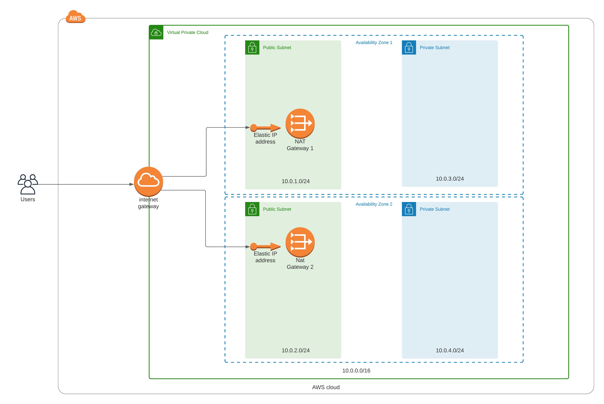
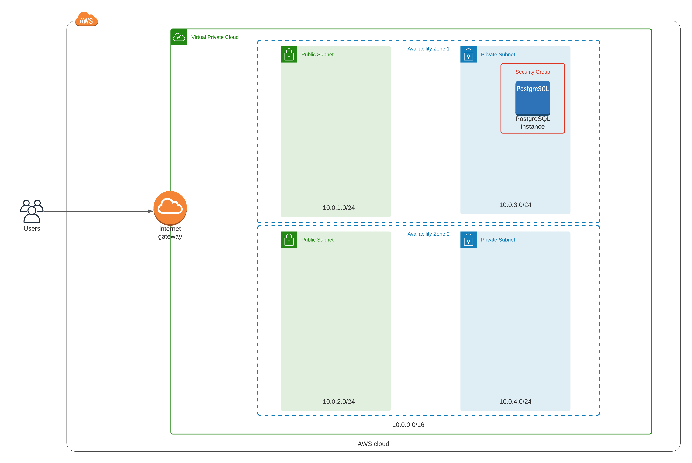

# Connector Street API deployment

This directory contains all the files needed to deploy the infrastructure in the AWS Cloud.

## Parameter Store

It is important to note that the templates store sensitive data, and 
that the correct approach is to use a Parameter Store.
With CloudFormation we can reference those parameters.

References:
- [CloudFormation Dynamic references](https://docs.aws.amazon.com/AWSCloudFormation/latest/UserGuide/dynamic-references.html)
- [AWS Systems Manager Parameter Store](https://console.aws.amazon.com/systems-manager/parameters)


## Domain

The first and easiest step is to go to Route 53 and buy a domain. We
will be using this domain for the backend API.

Reference: [Register a Domain in Route 53](https://console.aws.amazon.com/route53/home#DomainRegistration:)


## SSL Certificate

Before you create The ECS infrastructure, which includes an Application 
Load Balancer, you must create a SSL Certificate using the AWS Certificate Manager. Please create 2 certificates for:

- example.com
- *.example.com

Reference: [AWS Certificate Manager](https://console.aws.amazon.com/acm)

## Network

The network for this project has the following components:

- VPC: an isolated virtual network. With this, we have control over what resources are exposed to the internet.
- Public subnets: there are 2 public subnets. These subnets have direct access to the Internet through an Internet Gateway.
- Private subnets: there are 2 private subnets as well. These private subnets don't allow traffic from the internet.
- NAT Gateways: each public subnet has a NAT Gateway available, exposed by a static IP address (Elastic IP address). Resources in the private subnets must communicate through the NAT Gateway in order to "talk" to the internet.
- Internet Gateway: this component allows traffic to the internet.
- VPC IPV4 address space: 10.0.0.0/16 (65k ip addresses available in the VPC).
- Each subnet has available 256 IP addresses available.

Below is a visual representation of the network:



Execute the following command to create the network.

```bash
aws cloudformation create-stack \
--stack-name cstreet-network-prod \
--template-body file://deployment/infrastructure/network/network.yml \
--parameter file://deployment/infrastructure/network/network-params.json \
--capabilities "CAPABILITY_IAM" "CAPABILITY_NAMED_IAM" \
--region=us-east-1
```

## Database

The selected RDBMS for this project is PostgreSQL.

- Version: 13.2.
- Hosted in AWS RDS.
- The database is placed in a Private Subnet to follow best practices.
This means that there is no public access to the database, making it completely isolated.

In order to deploy the database, please verify that the version you are 
looking for is available in your region and has the instance type that you want.


Command for finding out the RDS class instances for a given db version:

```bash
aws rds describe-orderable-db-instance-options --engine $engine --engine-version $version \
    --query "*[].{DBInstanceClass:DBInstanceClass,StorageType:StorageType}|[?StorageType=='gp2']|[].{DBInstanceClass:DBInstanceClass}" \
    --output text \
    --region $region
```

Execute the following command to create the database.

```bash
aws cloudformation create-stack \
--stack-name cstreet-databases-prod \
--template-body file://deployment/infrastructure/database/database.yml \
--parameter file://deployment/infrastructure/database/database-params.json \
--capabilities "CAPABILITY_IAM" "CAPABILITY_NAMED_IAM" \
--region=us-east-1
```

Hiding some network components (NAT Gateways), when we execute the previous command, we will have the following:




## AWS ECR Repositories for docker images

Command to create the ECR Repositories.

```bash
aws cloudformation create-stack \
--stack-name cstreet-ecr-repositories-prod \
--template-body file://deployment/infrastructure/containers/ecr-repositories.yml \
--parameter file://deployment/infrastructure/containers/ecr-repositories-params.json \
--capabilities "CAPABILITY_IAM" "CAPABILITY_NAMED_IAM" \
--region=us-east-1
```


### Docker images workflow

Once we create the ECR Repos, we can start with the following steps to push an 
image to our private repos.

Django image build from docker-compose file:

```bash
docker-compose -f production.yml build django
```

To tag the django image:
```bash
docker tag cstreet_api_production_django 520099902592.dkr.ecr.us-east-1.amazonaws.com/cstreet_api_production_django
```

To push the image:

First authenticate Docker to an Amazon ECR private registry with get-login-password:

```bash
aws ecr get-login-password --region us-east-1 | docker login --username AWS --password-stdin 520099902592.dkr.ecr.us-east-1.amazonaws.com
```

Then, push the image to the private AWS ECR repository:

```bash
docker push 520099902592.dkr.ecr.us-east-1.amazonaws.com/cstreet_api_production_django
```

## Environment Files

The tasks definitions of the ECS Services requires some environment files.
These environment files must be stored in a S3 bucket.

There are currently 2 environment files that are required:

First env file: `.django.env` (sample):

```
# General
# ------------------------------------------------------------------------------
# DJANGO_READ_DOT_ENV_FILE=True
DJANGO_SETTINGS_MODULE=config.settings.production
DJANGO_SECRET_KEY=
DJANGO_ADMIN_URL=
DJANGO_ALLOWED_HOSTS=

# Security
# ------------------------------------------------------------------------------
# TIP: better off using DNS, however, redirect is OK too
DJANGO_SECURE_SSL_REDIRECT=False

# Email
# ------------------------------------------------------------------------------
DJANGO_SERVER_EMAIL=


# AWS
# ------------------------------------------------------------------------------
DJANGO_AWS_ACCESS_KEY_ID=
DJANGO_AWS_SECRET_ACCESS_KEY=
DJANGO_AWS_STORAGE_BUCKET_NAME=

DJANGO_AWS_ACCESS_KEY_FOR_ANYMAIL_SES=
DJANGO_AWS_SECRET_KEY_FOR_ANYMAIL_SES=

# django-allauth
# ------------------------------------------------------------------------------
DJANGO_ACCOUNT_ALLOW_REGISTRATION=True

# Gunicorn
# ------------------------------------------------------------------------------
WEB_CONCURRENCY=4


# Redis
# ------------------------------------------------------------------------------
# REDIS_URL=redis://redis:6379/0
REDIS_URL=

# Celery
# ------------------------------------------------------------------------------

# Flower
CELERY_FLOWER_USER=
CELERY_FLOWER_PASSWORD=

# Django Migrations
# ------------------------------------------------------------------------------
DATABASE_URL=postgres://username:password@db_host:5432/db_name
CELERY_BROKER_URL=redis://localhost:6379/0

# AWS Credentials
# ------------------------------------------------------------------------------
AWS_ACCESS_KEY_ID=
AWS_SECRET_ACCESS_KEY=
AWS_DEFAULT_REGION=us-east-1
```

Second env file: `.postgres.env` (sample)

```
# PostgreSQL
# ------------------------------------------------------------------------------
POSTGRES_HOST=
POSTGRES_PORT=5432
POSTGRES_DB=
POSTGRES_USER=
POSTGRES_PASSWORD=
```


That being said, we are going to create a S3 bucket:

```bash
aws s3api create-bucket --bucket connector-street-env --region us-east-1
```

Next, we need to upload the environment files:

```bash
aws s3 cp --recursive ./.envs/.production/ s3://connector-street-env/
```

## Tasks Definitions for ECS Services

Command to create the Tasks Definitions infrastructure.

```bash
aws cloudformation create-stack \
--stack-name cstreet-tasks-definitions-prod \
--template-body file://deployment/infrastructure/containers/tasks-definitions.yml \
--parameter file://deployment/infrastructure/containers/tasks-definitions-params.json \
--capabilities "CAPABILITY_IAM" "CAPABILITY_NAMED_IAM" \
--region=us-east-1
```

Command to update the stack:

```bash
aws cloudformation deploy \
--stack-name cstreet-tasks-definitions-prod \
--template-file deployment/infrastructure/containers/tasks-definitions.yml \
--capabilities "CAPABILITY_IAM" "CAPABILITY_NAMED_IAM"
```


## ECS infrastructure.

First make sure you have the required Role:

```bash
aws iam create-service-linked-role --aws-service-name ecs.amazonaws.com
```

Then create the ECS infrastructure


```bash
aws cloudformation create-stack \
--stack-name cstreet-ecs-prod \
--template-body file://deployment/infrastructure/containers/ecs.yml \
--parameter file://deployment/infrastructure/containers/ecs-params.json \
--capabilities "CAPABILITY_IAM" "CAPABILITY_NAMED_IAM" \
--region=us-east-1
```

Command to update the stack:

```bash
aws cloudformation deploy \
--stack-name cstreet-ecs-prod \
--template-file deployment/infrastructure/containers/ecs.yml \
--capabilities "CAPABILITY_IAM" "CAPABILITY_NAMED_IAM"
```

## Database Migrations

The container Celerybeat won't spin up until we apply the migrations to the database.

So, in order to use the app, we need to apply the migrations to the database, and to
do that, we need enter the container running django and execute the command:


```bash
CLUSTER_NAME=cstreet-fargate-cluster-prod
TASK=$(aws ecs list-tasks --cluster cstreet-fargate-cluster-prod \
--family backend | jq --raw-output '.taskArns[0]')

aws ecs execute-command --cluster $CLUSTER_NAME \
    --task $TASK \
    --container django \
    --interactive \
    --command "/bin/bash"

python manage.py migrate --no-input
```

## Misc

Get the ARN of some task:

```bash
TASK=$(aws ecs list-tasks --cluster cstreet-fargate-cluster-prod \
--family backend | jq --raw-output '.taskArns[0]')
```

Download existing Task definition:

```bash
aws ecs describe-task-definition \
   --task-definition backend \
   --query taskDefinition > deployment/tasks/backend-task-def.json
```

Script for changing task definition file:

```bash
python3 deployment/scripts/update_task_definition.py \
    --container-name django \
    --image-uri aws-ecr.com/django \
    --task-definition deployment/tasks/backend-task-def.json
```

Script for registering a new task definition in AWS:

```bash
aws ecs register-task-definition \
    --cli-input-json file://deployment/tasks/backend-task-def.json
```

And to get the new taskDefinitionArn (requires jq):

```bash
TASK_DEFINITION_ARN=$(aws ecs register-task-definition \
    --cli-input-json file://deployment/tasks/traefik-task-def.json | jq \
    --raw-output '.taskDefinition.taskDefinitionArn')
```

Update an ECS Service:

```bash
aws ecs update-service \
    --cluster cstreet-fargate-cluster-prod \
    --service backend \
    --task-definition $TASK_DEFINITION_ARN \
    --force-new-deployment \
    --deployment-configuration "maximumPercent=200,minimumHealthyPercent=100,deploymentCircuitBreaker={enable=true,rollback=true}"
```

Update a Task Definition:

```bash
aws ecs register-task-definition \
    --cli-input-json file://deployment/tasks/backend-task-def.json
```
